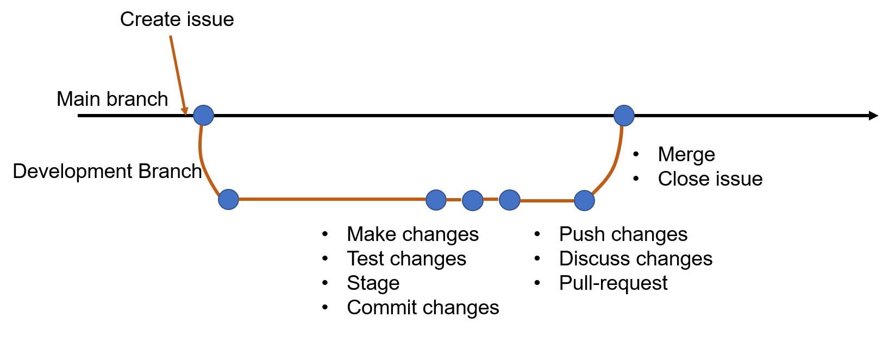

<style>
.forceBreak { -webkit-column-break-after: always; break-after: column; }
</style>

```{r setup, include=FALSE}
knitr::opts_chunk$set(echo = FALSE)
```

## Workshop overview

<font size="4">
Welcome! This workshop series will be focused on data reproducibility!

- Day 1 (today): Metadata and version control
- Day 2 (tomorrow): Single-cell preprocessing and containerization
- Day 3 (Wednesday): Single-cell standard analysis and jupyter

Each session will consist of a 30 minute presentation followed by a 60-90 minute live demonstration.

Feel free to follow along, or refer to the recording after the conclusion of the workshop.

There will be a Q&A period after the live demo (time permitting), but feel free to enter questions into the Q&A feature in Zoom.

Can also enter questions into a padlet: https://padlet.com/murra320/data-reproducibility-workshop-6wghd1yku72siz5z
</font>

## Outline
In this workshop, we will:

- Explain why describing your data (metadata) is important
- Introduce version control and explain why it's important
- Introduce Git and Github
- Demonstrate using Git / Github

## A simple scenario
<div class="columns-2">
<font size="4">

Your group is funded to use single-cell methods to study osmotic stress in
plants (lucky you!)

Your sampling plan includes profiling:

- 2 replicates of root nuclei from control-treated plants
- 2 replicates of root nuclei sorbitol-treated plants

You grew your plants on agar plates, collected the tissue, and used the 10x Genomics
Multiome (GEX + ATAC-seq) single-cell kits to build your libraries.

You have now received the RNA sequencing data from your core facility and are ready to start analysis. Yay!


</div>
</font>

## A simple scenario

But WAIT!


How will you document your analysis?

How will you conduct your analysis so others can reproduce it?

Have you recorded your metadata?

## Why data reproducibility

An analysis pipeline is reproducible if others can pick up your 
data, metadata, and source code, re-run your analysis, and come to 
roughly the same result / conclusion. 

* Important for critical assessment of analysis
* Important for your own sanity

Data reproducibility starts with *metadata* -- documenting how your 
experimental samples were generated.

## What is metadata?
<font size="4">

Metadata is data used to describe other data.

- Growth conditions, experimental factors of your samples
- Particle type, dissociation details, sample QC
- Library preparation details (kit, version, read structure)
- Sequencing details (accession numbers, platform)
- Cell-level metadata (important for post-analysis)
- Code!

Several metadata schemas exist for single-cell

- COPO (https://singlecellschemas.org)
- Annotare (https://www.ebi.ac.uk/fg/annotare)

Sample: https://github.com/plantcellatlas/data-rep-workshop/blob/main/docs/pca_datarepro_manifest_terms.xlsx

</font>

## OK can I analyze my data now?!
<font size="5">

Not so fast.

- What happens if metadata changes?

  * new samples
  * additional context you forgot to include
  * re-run of sequencing

Any change in metadata / data sources will impact resulting code. How can 
you keep track of it all?

</font>

## What is version control

<div class="columns-2">


- Tracking changes in code
- Tracking changes in data / metadata
- Sharing and managing those changes with others
- Reverting code when errors are introduced

</div>

## Your project needs version control

<div class="columns-2">
- You document all your benchwork in a lab notebook (right?). Code is the 
"Methods" section of your project for bioinformatics analysis. 
- Code can be overwritten, deleted, modified. This should be tracked so it can 
be
  - reused
  - shared
  - improved


</div>

## Version control with Git

<div class = "columns-2">
<font size="3">

 * Created by Linus Torvalds (of Linux fame) in 2005
 * Designed to track changes in a project and sync changes
 * Key terms:
     * Repository
     * Local
     * Remote
     * Branch
     * Commit
     * Clone
     * Push
     * Pull
     
</font>
<p class = "forceBreak"></p>

<font size="1">Credit: Wikipedia (https://en.wikipedia.org/wiki/Git)</font>
</div>

## Initiating a git repository
<font size="4">
There are two ways to initiate a Git repository:

  * On a remote server (e.g. GitHub)
  * Locally using `git init`
  
`.gitignore` file

  * Tells `git` not to track certain files that match various patterns
  * Useful when creating large numbers of data files that are not code
  
`git` creates an internal `.git` folder.

Other folders you might want to generate when creating your repository:

  * `src/` - for code files
  * `metadata/` - for storing machine- and human-readable files (I like \*.csv)
  * `docs` - for documentation, reports, 
  * `data` - for data files generated by your code that you want hosted (or for internal use)

</font>

## GitHub

GitHub (https://www.github.com) is a large online database of git repositories

  * Can serve as a remote repository for your project
  * Is free to use for most people, but service is limited on the free tier
  * Includes features like issue tracking, releases, and others
  * Very useful for collaborating with other developers and the community
  
Other, similar tools include:

  * GitLab
  * BitBucket (Atlassian)

## GitHub Workflow: An Example

Let's say you've identified an issue with your metadata documentation or want to add a new analysis script.

A typical workflow:

1. **Create an issue** - document the problem or task
2. **Create a branch** - isolated space to make changes
3. **Fetch and checkout** - download branch and switch to it locally
4. **Edit files** - make your changes
5. **Stage files** - prepare changes for commit
6. **Commit** - save changes with a message
7. **Push** - upload changes to remote
8. **Create pull request** - propose changes
9. **Merge** - integrate changes into main branch

## Step 1: Create an Issue

<font size="5">
On GitHub, create a new issue to:

- Document bugs or problems
- Propose new features or analyses
- Assign tasks to team members
- Discuss implementation before coding

Issues can be:
- Referenced in commits: `git commit -m "fixes #42"`
- Automatically closed by pull requests
- Labeled for organization (e.g., bug, enhancement, documentation)

</font>

## Step 2: Create a Branch

A **branch** is an independent line of development:

```
git branch feature/add-cell-qc
```

OR create and checkout in one command:

```
git checkout -b feature/add-cell-qc
```

Benefits:

- Main branch stays stable while you work
- Multiple team members can work on different features simultaneously
- Easy to abandon changes if needed

Branch naming conventions: `feature/name`, `bugfix/name`, `docs/name`

## Step 3: Fetch & Checkout

When collaborating, get the latest changes:

```
git fetch origin
```

This downloads remote branches without modifying your local work.

Then checkout your branch:

```
git checkout feature/add-cell-qc
```

This switches your local repository to that branch.

## Step 4: Edit Files

Make your changes in your text editor or IDE:

- Update metadata files
- Modify analysis scripts
- Add documentation

Your changes are only in your local repository until you explicitly share them.

## Step 5: Stage Files

Prepare specific files for commit:

```
git add metadata/sample_metadata_sample.csv
git add src/analysis.R
```

Stage all changes:

```
git add -A
```

Check what's staged:

```
git status
```

## Step 6: Commit Changes

Save your staged changes with a descriptive message:

```
git commit -m "Add cell QC thresholds to sample metadata"
```

Good commit messages:

- Start with a verb: "Add", "Fix", "Update", "Remove"
- Be specific about what changed
- Keep it concise but informative

Each commit is a snapshot of your project at that moment in time.

## Step 7: Push to Remote

Upload your commits to GitHub:

```
git push origin feature/add-cell-qc
```

This makes your work available to collaborators and GitHub.

Multiple team members can now see your commits and provide feedback.

## Step 8: Create a Pull Request

On GitHub, create a **pull request** (PR) to:

- Propose merging your branch into main
- Describe your changes
- Allow team members to review code
- Discuss implementation details

PR benefits:

- Documentation of design decisions
- Code review and quality control
- Opportunity for feedback before merging

## Step 9: Merge

After review and approval, merge your branch into main:

```
git merge feature/add-cell-qc
```

Or merge via GitHub interface (recommended for team projects).

Result: Your changes are now in the main branch, available to all collaborators.

## The Complete Workflow Diagram

<font size="4">

<table style="width: 100%;">
  <tr>
    <td style="width: 33%; vertical-align: top;">
      <strong>Your Local Repository:</strong>
      <ol>
        <li>Create/checkout branch</li>
        <li>Edit files</li>
        <li>Stage changes</li>
        <li>Commit</li>
        <li>Push commits</li>
      </ol>
    </td>
    <td style="width: 33%; vertical-align: top;">
      <strong>Remote Repository (GitHub):</strong>
      <ol start="6">
        <li>Create PR</li>
        <li>Review commits</li>
        <li>Code review</li>
        <li>Merge to main</li>
      </ol>
    </td>
    <td style="width: 33%; vertical-align: top;">
      <strong>Other Team Members:</strong>
      <ul>
        <li>Pull latest changes</li>
        <li>See full history</li>
        <li>Can create new branches</li>
      </ul>
    </td>
  </tr>
</table>

</font>



## Multiple Copies, One Source of Truth

<font size="5">

Git enables a powerful collaboration pattern:

- **Remote (GitHub):** Central repository everyone can access
- **Local copies:** Each team member has a full copy on their machine
- **Synchronization:** Changes flow through branches and pull requests

Your plant genomics team:

- Dr. A works on cell type annotation locally
- Dr. B works on trajectory analysis locally
- Both push to the shared remote repository
- Each has the full project history

</font>

## Project Evolution: Viewing History

Git maintains a complete record of your project:

```
git log --oneline
```

Example output:
```
a1b2c3d Fix filtering thresholds in QC script (fixes #24)
e4f5g6h Add cell type annotations from manual review
i7j8k9l Update sample metadata with dissociation details
m0n1o2p Initial commit: metadata template and basic QC
```

This allows you to:

- Understand decisions made months ago
- Trace back to when a bug was introduced
- Recover old versions of files
- Document the evolution of your analysis

## Reverting Changes: The Safety Net

<font size="3">

Made a mistake? Git has you covered.

**Revert a recent commit:**
```
git revert a1b2c3d
```

**Revert a range of commits (oldest to newest):**
```
git revert a1b2c3d^..e4f5g6h
```

**Go back to a previous version:**
```
git restore --source a1b2c3d -- src/analysis.R
```

**Undo uncommitted changes:**
```
git restore src/analysis.R
```

**View what changed in a specific commit:**
```
git show a1b2c3d
```

This safety net encourages experimentation and collaboration without fear of losing work.

</font>

## Live Demonstration!

Having just generated a single-cell dataset, we'd like to start processing. To
start, lets document our samples, and track our changes using `git`.

Here we will:

  * Create a git repository
  * Explore "issues" and "pull requests" via GitHub
  * Fill out a metadata sheet
  * Edit the metadata sheet
  * Divide work across collaborators
  * Explore what happens when there's a conflict
